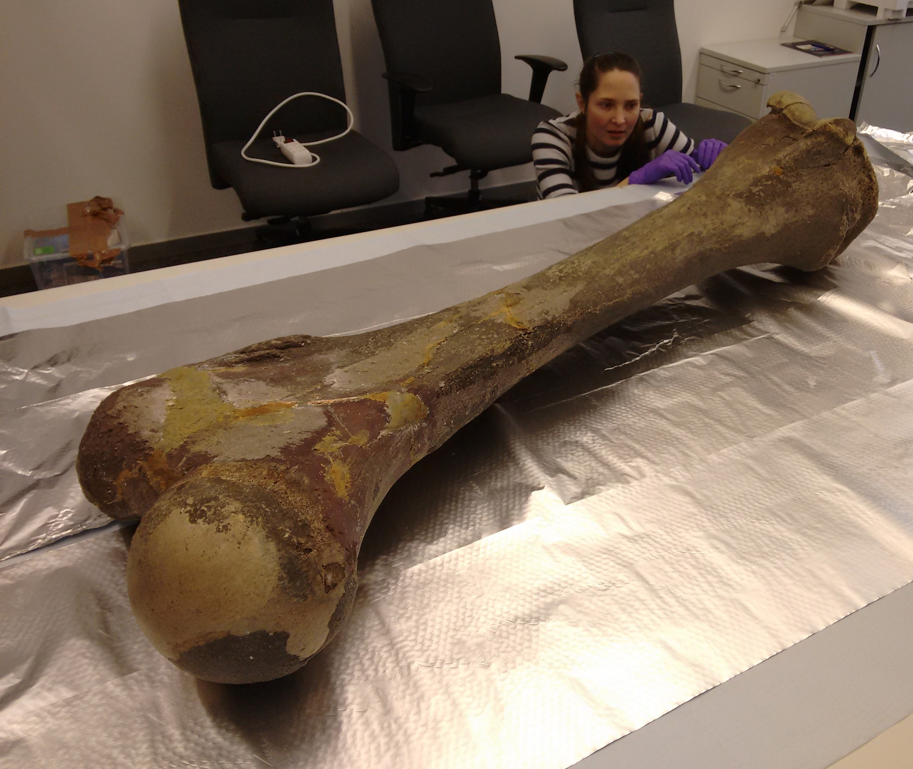
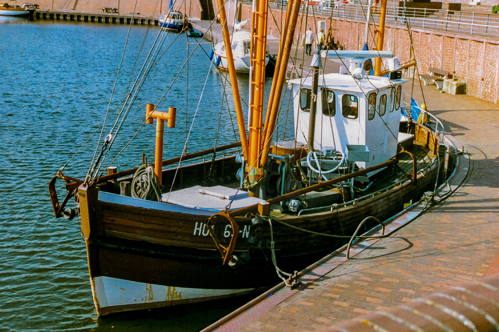

```{r setup, include = FALSE}
library(tidyverse)
library(gganimate)
library(RColorBrewer)
library(knitr)
library(ape)
```

<!-- adding bold and italic options -->
<style>
em {
  font-style: italic
}
strong {
  font-weight: bold;
}
</style>

## Ancient DNA

- Molecular phylogenetics
- Ancient DNA
- Sabretooth cats
- Sequencing the North Sea *Homotherium*

```{r, out.width = "45%", dpi = 300, echo = FALSE, fig.align='right'}
include_graphics("./assets/img/smilodon1.png")
```

--- .segue .dark 

## Molecular phylogenetics

--- &thirds bg:white

## You've probably seen diagrams like this...

### This is called a `phylogeny`. It represents the evolutionary process

*** =right

```{r, out.width = "70%", fig.width = 3, fig.height = 3, dpi = 600, fig.align = "center", echo = FALSE}

my.tree <- read.tree(text="((((human,chimp),(cat,dog)),(snake,lizard)),fish);")
par(mar=c(1,1,1,1))
plot(my.tree)
```

*** =left

- The phylogeny works like an evolutionary tree
- The tips are species
- Nodes are their common ancestors
- **Molecular phylogenies** are calculated using genetic data

--- &twocol

## Mutation and inheritance creates the tree

*** =left

```{r, out.width = "100%", dpi = 300, echo = FALSE, fig.align='center'}

```

- Human mutation rate ~1.1×10^−8 per site per generation
- ~40 mutations in your 3.6 Gb genome
- inherited by offspring

*** =right

```{r, out.width = "80%", dpi = 300, echo = FALSE, fig.align='center'}
include_graphics("./assets/img/inheritance_tree.svg")
```

- DNA divergence and time are (approximately) linearly related
- Branch lengths show the genetic divergence

--- &vcenter

## DNA sequence alignment

```{r, out.width = "75%", dpi = 300, echo = FALSE, fig.align='center'}
include_graphics("./assets/img/DNA_aling.svg")
```

--- &thirds

## Mitochondrial DNA is great for phylogenetics!

*** =right

```{r, out.width = "100%", dpi = 300, echo = FALSE, fig.align='center'}

```

*** =left

- Small
- High mutation rate
- Many copies per cell
- Maternally inherited

--- .segue .dark 

## Ancient DNA

--- .class #id

## Ancient DNA is just old DNA

```{r, out.width = "80%", dpi = 300, echo = FALSE, fig.align='center'}
include_graphics("./assets/img/samples.png")
```

--- .class #id

## Some samples don't fit in the lab!

```{r, out.width = "65%", dpi = 300, echo = FALSE, fig.align='center'}

```

--- .class #id

## Study species

```{r, out.width = "90%", dpi = 300, echo = FALSE, fig.align='center'}
include_graphics("./assets/img/extinct.png")
```

*Glyptodont, WolfmanSF, CC BY_SA 3.0*

--- .class #id

## After thousands of years, most of the DNA is lost

```{r, out.width = "80%", dpi = 300, echo = FALSE, fig.align='center'}

```
*Zátonyi Sándor, (ifj.) Fizped, CC BY-SA 3.0*


--- .class #id

## This makes the work contamination sensitive

```{r, out.width = "75%", dpi = 300, echo = FALSE, fig.align='center'}
include_graphics("./assets/img/sina_lab.jpg")
```

--- .class bg:white

## But the samples are already highly contaminated

```{r, out.width = "60%", fig.width = 6, fig.height = 5, dpi = 600, fig.align = "center", echo = FALSE}
par(mar=c(0,0,0,6))
my_slices <- c(1.1,14.4,0.73,17.3,66.52)
my_lab <- c("CAVE BEAR", "Prokaryotes", "other Eukaryotes", "undet. environmental", "unknown")
pie(my_slices, labels = my_lab, col=brewer.pal(6, "Set1"), cex=1.7)

```

*Data from Noonan et al. 2005. Science*

--- .segue .dark 

## Sabretooth cats

--- &twocol

## There were two genera of sabretooth cats

- **A genus is a group of closely related species. It's the first part of the scientific name**
- **e.g.** ***Homo sapiens***

*** =left

### *Smilodon*

- The most commonly known group
- Massive canines
- > 400 kg and 120 cm shoulder height
- N and S America
- 3 species, *S. gracilis, S. populator, S. fatalis*
- Extinction 10 ka

*** =right

```{r, out.width = "100%", dpi = 300, echo = FALSE, fig.align='center'}
include_graphics("./assets/img/smilodon_skull.jpg")
```

--- &twocol

## There were two genera of sabretooth cats

- **A genus us a group of closely related species. It's the first part of the scientific name**
- **e.g.** ***Homo sapiens***

*** =left

### *Homotherium*

- Less known group
- Also known as scimitar-toothed cats
- Flat, serrated canines
- ~ 200 kg and 110 cm shoulder height
- Europe, Africa, N and S America
- Europe: *H. latidens*, extinction 300 ka
- N. America: *H. serum*, extinction 12 ka

*** =right

```{r, out.width = "100%", dpi = 300, echo = FALSE, fig.align='center'}
include_graphics("./assets/img/Homotherium_serum.jpg")
```

*Sergiodlarosa, CC BY-SA 3.0*

--- .class #id

## *Homotherium* skull

```{r, out.width = "90%", dpi = 300, echo = FALSE, fig.align='center'}
include_graphics("./assets/img/Homotherium_crenatidens_skull_45.jpg")
```

*Ghedoghedo, CC BY-SA 4.0*

--- &twocol

## Fishing for fossils

*** =left

- Britain connected to mainland Europe by an area called **Doggerland**
- Rising sea levels 6-7 ka flooded the area, making Britain an island

```{r, out.width = "90%", dpi = 300, echo = FALSE, fig.align='center'}

```

*** =right

```{r, out.width = "90%", dpi = 300, echo = FALSE, fig.align='center'}
include_graphics("./assets/img/Doggerland.svg")
```

*Max Naylor, CC BY-SA 3.0*

--- &vcenter

## 16th March 2000, something surprising turned up...

```{r, out.width = "100%", dpi = 300, echo = FALSE, fig.align='center'}
include_graphics("./assets/img/NS_Homo.png")
```

### This didn't look like a 300 ka fossil

--- .class #id

## Analysis of the Dutch North Sea *Homotherium*

### Dating

 >- The bone was radiocarbon dated at 31,300 ± 400!
 >- This was extraordinary, so the dating was repeated:
  + 31,300 ± 400
  + 26,900 ± 400
  + 26,700 ± 240
  + 28,100 ± 220
  + 27,650 ± 280

>- The first Late Pleistocene European *Homotherium*

--- .segue .dark 

## Sequencing the North Sea *Homotherium*

--- &vcenter

## Sequencing of ancient DNA

```{r, out.width = "95%", dpi = 300, echo = FALSE, fig.align='center'}
include_graphics("./assets/img/aDNA_seq.svg")
```

--- &vcenter

## Sequencing experiment 1

>- ## Total sequences = 2,628,309

>- ## Mapped sequences grand total = 

>- ## 1

--- &twocol bg:white

## DNA hybridisation capture

*** =left

- DNA has 2 strands, arrange in a double helix
- It can be heat denatured
- When cooled, the single strands will stick (hybridise) to strands with a similar sequence
- We can "fish" target sequences from a pool of contaminants

*** =right

```{r, out.width = "110%", dpi = 300, echo = FALSE}
include_graphics("./assets/img/dna-1889085.jpg")
```

--- &vcenter

## DNA hybridisation capture*

```{r, out.width = "90%", dpi = 300, echo = FALSE}
include_graphics("./assets/img/hybr.svg")
```

### *Of course this only works if you know the sequence in advance

--- &thirds bg:white

## Meanwhile a Danish group were sequencing North American cave lion mtDNA

*** =right

```{r, out.width = "90%", dpi = 300, echo = FALSE, fig.align='center'}
include_graphics("./assets/img/NA_Homo.png")
```

*** =left

- Sequence analysis showed it was actually a *Homotherium*
- This provided the sequence for the hybridisation cature baits

--- &vcenter

## Sequencing experiment 2 (hybridisation capture)

>- ## Total sequences = 72,759,982

>- ## Mapped sequences grand total = 

>- ## 12,050,089

--- .class #id

## Phylogenetic analysis of sabretooth cats

```{r, out.width = "85%", dpi = 300, echo = FALSE, fig.align='center'}
include_graphics("./assets/img/sabre_tree_NODATE.svg")
```

--- &twocol

## Mutation and inheritance creates the tree

*** =left

```{r, out.width = "100%", dpi = 300, echo = FALSE, fig.align='center'}

```

- Human mutation rate ~1.1×10^−8 per site per generation
- ~40 mutations in your 3.6 Gb genome
- inherited by offspring

*** =right

```{r, out.width = "80%", dpi = 300, echo = FALSE, fig.align='center'}
include_graphics("./assets/img/inheritance_tree.svg")
```

- DNA divergence and time are (approximately) linearly related
- Branch lengths show the genetic divergence

--- .class #id

## Molecular dating of sabretooth cats

```{r, out.width = "85%", dpi = 300, echo = FALSE, fig.align='center'}
include_graphics("./assets/img/sabre_tree.svg")
```

--- .class #id

## Molecular dating of sabretooth cats

- Sabretooths divergence from living cats 20 Ma
- *Homotherium* and *Smilodon* were more diverged from one another than any living cats
- A huge diversity was lost with the extinction of the sabretooths
- North American and European *Homotherium* were genetically similar
- We recommended they be treated as a single species, *H. latidens*

```{r, out.width = "45%", dpi = 300, echo = FALSE, fig.align='right'}
include_graphics("./assets/img/smilodon1.png")
```

--- .class #id

## Paijmans et al. 2017

```{r, out.width = "100%", out.height=500, dpi = 300, echo = FALSE}
include_graphics("./assets/img/Paijmans et al. - 2017.pdf")
```

--- &thankyou

## Ancient DNA

**Cutting edge technology to unlock the secrets of extinct animals**

